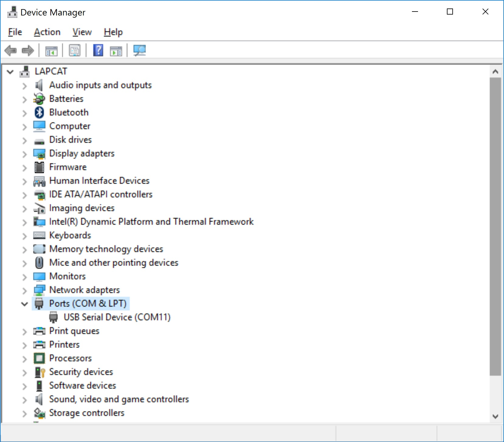

// EvohomeWirelessFW - RFBee firmware for evohome wireless communications  
// Copyright (c) 2015 Hydrogenetic  
// Modified 2017 by Fred Hoogduin  
// Copyright 2019  Simon Arlott
//  
// based on HoneyCommLite - Alternative RFBee firmware to communicate with  
//                 Evohome / Hometronix / CM67z and other Honeywell 868MHz based RF devices.  
//  
// Copyright (C) 2012 JB137  
// Copyright (C) 2011 Wladimir Komarow  
//  
// and work from CrazyDiamond and others at http://www.domoticaforum.eu/viewtopic.php?f=7&t=5806  
//  
// This program is free software: you can redistribute it and/or modify  
// it under the terms of the GNU General Public License as published by  
// the Free Software Foundation, either version 3 of the License, or  
// (at your option) any later version.  
//  
// This program is distributed in the hope that it will be useful,  
// but WITHOUT ANY WARRANTY; without even the implied warranty of  
// MERCHANTABILITY or FITNESS FOR A PARTICULAR PURPOSE.  See the  
// GNU General Public License for more details.  
//  
// You should have received a copy of the GNU General Public License  
// along with this program.  If not, see <http://www.gnu.org/licenses/>.  
//  
// Compile for RFbee using board: Arduino Pro or Pro Mini (3.3V, 8MHz) w/ATmega 168  

This should work with Domoticz (http://www.domoticz.com/wiki/Evohome) to control evohome
or you can control it directly via the serial interface if you use the correct protocol.
This sketch can also serve as template for creation of an evohome compatible wireless
device.

You will require an RFBee, probably a UartSBee (for USB serial connection to the RFBee)
and you will also need the Arduino IDE from http://arduino.cc/en/main/software or via
``sudo apt-get install arduino``. The RFBee is a 3.3v device so you should set the
voltage switch on the UartSBee to 3.3v instead of 5v. 

# RFBee versions
**NOTICE**
The RFBee exists with two different processors (or MCUs). 
RFBee *v1.0* and *v1.1* contain the AVR **ATmega168**.
RFbee *v1.2* contains the AVR **ATmega328**.  
See <http://wiki.seeed.cc/RFbee_V1.1-Wireless_Arduino_compatible_node/>.
# Arduino IDE
Download and install the Arduino IDE from <https://www.arduino.cc/en/main/software>.  

Once you have the IDE installed you should copy the sketch (EvohomeWirelessFW folder) to
your Sketchbook folder. You then select the correct board as above, choose the appropriate
serial device and select upload from the menu.
# PlatformIO
Download and install PlatformIO Core from <http://docs.platformio.org/en/latest/installation.html>.  
Once installed you can build and or upload the project from the command line.
## Build your project
Go to the root folder of the cloned project (the folder containing platformio.ini).

**The code is configured for RFBee v1.2. If you are using a RFBee v1.0 or v1.1, edit
platformio.ini and replace _pro8MHzatmega328_ with _pro8MHzatmega168_.**

Issue the following command: ``platformio run`` and you should see the build running
like:

```
$ platformio run
[02/26/17 14:33:26] Processing pro8MHzatmega328 (platform: atmelavr, board: pro8MHzatmega328, framework: arduino)

Verbose mode can be enabled via `-v, --verbose` option
Converting EvohomeWirelessFW.ino
Collected 28 compatible libraries
Looking for dependencies...
Project does not have dependencies
Compiling .pioenvs\pro8MHzatmega328\src\CCx.o
Compiling .pioenvs\pro8MHzatmega328\src\EvohomeWirelessFW.ino.o
Compiling .pioenvs\pro8MHzatmega328\src\Spi.o
Archiving .pioenvs\pro8MHzatmega328\libFrameworkArduinoVariant.a
Compiling .pioenvs\pro8MHzatmega328\FrameworkArduino\CDC.o
Compiling .pioenvs\pro8MHzatmega328\FrameworkArduino\HardwareSerial.o
Compiling .pioenvs\pro8MHzatmega328\FrameworkArduino\HardwareSerial0.o
Compiling .pioenvs\pro8MHzatmega328\FrameworkArduino\HardwareSerial1.o
src\CCx.cpp: In member function 'void CCX::Setup(byte)':
src\CCx.cpp:166:15: warning: unused variable 'temp' [-Wunused-variable]
byte temp = Write(reg,val);
^
C:/Users/fred/Documents/projects/github/EvohomeWirelessFW/src/EvohomeWirelessFW.ino: In function 'void loop()':
C:/Users/fred/Documents/projects/github/EvohomeWirelessFW/src/EvohomeWirelessFW.ino:999:60: warning: format '%hu' expects argument of type 'short unsigned int*', but argument 3 has type 'byte* {aka unsigned char*}' [-Wformat=]
C:/Users/fred/Documents/projects/github/EvohomeWirelessFW/src/EvohomeWirelessFW.ino:1049:45: warning: format '%hu' expects argument of type 'short unsigned int*', but argument 3 has type 'byte* {aka unsigned char*}' [-Wformat=]
C:/Users/fred/Documents/projects/github/EvohomeWirelessFW/src/EvohomeWirelessFW.ino:1089:37: warning: format '%hX' expects argument of type 'short unsigned int*', but argument 3 has type 'byte* {aka unsigned char*}' [-Wformat=]
Compiling .pioenvs\pro8MHzatmega328\FrameworkArduino\HardwareSerial2.o
src\Spi.cpp: In member function 'void SPI::mode(byte)':
src\Spi.cpp:47:9: warning: variable 'tmp' set but not used [-Wunused-but-set-variable]
byte tmp;
^
src\Spi.cpp: In member function 'byte SPI::slaveSelect(byte)':
src\Spi.cpp:72:1: warning: no return statement in function returning non-void [-Wreturn-type]
}
^
Compiling .pioenvs\pro8MHzatmega328\FrameworkArduino\HardwareSerial3.o
Compiling .pioenvs\pro8MHzatmega328\FrameworkArduino\IPAddress.o
Compiling .pioenvs\pro8MHzatmega328\FrameworkArduino\PluggableUSB.o
Compiling .pioenvs\pro8MHzatmega328\FrameworkArduino\Print.o
Compiling .pioenvs\pro8MHzatmega328\FrameworkArduino\Stream.o
Compiling .pioenvs\pro8MHzatmega328\FrameworkArduino\Tone.o
Compiling .pioenvs\pro8MHzatmega328\FrameworkArduino\USBCore.o
Compiling .pioenvs\pro8MHzatmega328\FrameworkArduino\WInterrupts.o
Compiling .pioenvs\pro8MHzatmega328\FrameworkArduino\WMath.o
Compiling .pioenvs\pro8MHzatmega328\FrameworkArduino\WString.o
Compiling .pioenvs\pro8MHzatmega328\FrameworkArduino\_wiring_pulse.o
Compiling .pioenvs\pro8MHzatmega328\FrameworkArduino\abi.o
Compiling .pioenvs\pro8MHzatmega328\FrameworkArduino\hooks.o
Compiling .pioenvs\pro8MHzatmega328\FrameworkArduino\main.o
Compiling .pioenvs\pro8MHzatmega328\FrameworkArduino\new.o
Compiling .pioenvs\pro8MHzatmega328\FrameworkArduino\wiring.o
Compiling .pioenvs\pro8MHzatmega328\FrameworkArduino\wiring_analog.o
Compiling .pioenvs\pro8MHzatmega328\FrameworkArduino\wiring_digital.o
Compiling .pioenvs\pro8MHzatmega328\FrameworkArduino\wiring_pulse.o
Compiling .pioenvs\pro8MHzatmega328\FrameworkArduino\wiring_shift.o
Archiving .pioenvs\pro8MHzatmega328\libFrameworkArduino.a
Linking .pioenvs\pro8MHzatmega328\firmware.elf
Calculating size .pioenvs\pro8MHzatmega328\firmware.elf
Building .pioenvs\pro8MHzatmega328\firmware.hex
AVR Memory Usage
----------------
Device: atmega328p

Program:    9282 bytes (28.3% Full)
(.text + .data + .bootloader)

Data:        803 bytes (39.2% Full)
(.data + .bss + .noinit)


 [SUCCESS] Took 2.07 seconds
```
## Upload to the RFBee

To upload the code to your RFBee, the combination RFBee/UartSBee should be connected to
your PC. The correct drivers must be installed. On Windows, when you open your device
manager should show a USB COM port.



Issue the following command: ``platformio run --target upload`` and you should see the
build running like:

```
$ platformio run --target upload
[02/26/17 15:21:32] Processing pro8MHzatmega328 (platform: atmelavr, board: pro8MHzatmega328, framework: arduino)

Verbose mode can be enabled via `-v, --verbose` option
Converting EvohomeWirelessFW.ino
Collected 28 compatible libraries
Looking for dependencies...
Project does not have dependencies
Compiling .pioenvs\pro8MHzatmega328\src\CCx.o
Compiling .pioenvs\pro8MHzatmega328\src\EvohomeWirelessFW.ino.o
Compiling .pioenvs\pro8MHzatmega328\src\Spi.o
Archiving .pioenvs\pro8MHzatmega328\libFrameworkArduinoVariant.a
Compiling .pioenvs\pro8MHzatmega328\FrameworkArduino\CDC.o
Compiling .pioenvs\pro8MHzatmega328\FrameworkArduino\HardwareSerial.o
Compiling .pioenvs\pro8MHzatmega328\FrameworkArduino\HardwareSerial0.o
Compiling .pioenvs\pro8MHzatmega328\FrameworkArduino\HardwareSerial1.o
src\CCx.cpp: In member function 'void CCX::Setup(byte)':
src\CCx.cpp:166:15: warning: unused variable 'temp' [-Wunused-variable]
byte temp = Write(reg,val);
^
C:/Users/fred/Documents/projects/github/EvohomeWirelessFW/src/EvohomeWirelessFW.ino: In function 'void loop()':
C:/Users/fred/Documents/projects/github/EvohomeWirelessFW/src/EvohomeWirelessFW.ino:999:60: warning: format '%hu' expects argument of type 'short unsigned int*', but argument 3 has type 'byte* {aka unsigned char*}' [-Wformat=]
C:/Users/fred/Documents/projects/github/EvohomeWirelessFW/src/EvohomeWirelessFW.ino:1049:45: warning: format '%hu' expects argument of type 'short unsigned int*', but argument 3 has type 'byte* {aka unsigned char*}' [-Wformat=]
C:/Users/fred/Documents/projects/github/EvohomeWirelessFW/src/EvohomeWirelessFW.ino:1089:37: warning: format '%hX' expects argument of type 'short unsigned int*', but argument 3 has type 'byte* {aka unsigned char*}' [-Wformat=]
Compiling .pioenvs\pro8MHzatmega328\FrameworkArduino\HardwareSerial2.o
src\Spi.cpp: In member function 'void SPI::mode(byte)':
src\Spi.cpp:47:9: warning: variable 'tmp' set but not used [-Wunused-but-set-variable]
byte tmp;
^
src\Spi.cpp: In member function 'byte SPI::slaveSelect(byte)':
src\Spi.cpp:72:1: warning: no return statement in function returning non-void [-Wreturn-type]
}
^
Compiling .pioenvs\pro8MHzatmega328\FrameworkArduino\HardwareSerial3.o
Compiling .pioenvs\pro8MHzatmega328\FrameworkArduino\IPAddress.o
Compiling .pioenvs\pro8MHzatmega328\FrameworkArduino\PluggableUSB.o
Compiling .pioenvs\pro8MHzatmega328\FrameworkArduino\Print.o
Compiling .pioenvs\pro8MHzatmega328\FrameworkArduino\Stream.o
Compiling .pioenvs\pro8MHzatmega328\FrameworkArduino\Tone.o
Compiling .pioenvs\pro8MHzatmega328\FrameworkArduino\USBCore.o
Compiling .pioenvs\pro8MHzatmega328\FrameworkArduino\WInterrupts.o
Compiling .pioenvs\pro8MHzatmega328\FrameworkArduino\WMath.o
Compiling .pioenvs\pro8MHzatmega328\FrameworkArduino\WString.o
Compiling .pioenvs\pro8MHzatmega328\FrameworkArduino\_wiring_pulse.o
Compiling .pioenvs\pro8MHzatmega328\FrameworkArduino\abi.o
Compiling .pioenvs\pro8MHzatmega328\FrameworkArduino\hooks.o
Compiling .pioenvs\pro8MHzatmega328\FrameworkArduino\main.o
Compiling .pioenvs\pro8MHzatmega328\FrameworkArduino\new.o
Compiling .pioenvs\pro8MHzatmega328\FrameworkArduino\wiring.o
Compiling .pioenvs\pro8MHzatmega328\FrameworkArduino\wiring_analog.o
Compiling .pioenvs\pro8MHzatmega328\FrameworkArduino\wiring_digital.o
Compiling .pioenvs\pro8MHzatmega328\FrameworkArduino\wiring_pulse.o
Compiling .pioenvs\pro8MHzatmega328\FrameworkArduino\wiring_shift.o
Archiving .pioenvs\pro8MHzatmega328\libFrameworkArduino.a
Linking .pioenvs\pro8MHzatmega328\firmware.elf
Checking program size
text       data     bss     dec     hex filename
9116        166     637    9919    26bf .pioenvs\pro8MHzatmega328\firmware.elf
Building .pioenvs\pro8MHzatmega328\firmware.hex
Looking for upload port...
Auto-detected: COM4
Uploading .pioenvs\pro8MHzatmega328\firmware.hex

avrdude: AVR device initialized and ready to accept instructions

Reading | ################################################## | 100% 0.00s

avrdude: Device signature = 0x1e950f (probably m328p)
avrdude: reading input file ".pioenvs\pro8MHzatmega328\firmware.hex"
avrdude: writing flash (9282 bytes):

Writing | ################################################## | 100% 4.67s

avrdude: 9282 bytes of flash written
avrdude: verifying flash memory against .pioenvs\pro8MHzatmega328\firmware.hex:
avrdude: load data flash data from input file .pioenvs\pro8MHzatmega328\firmware.hex:
avrdude: input file .pioenvs\pro8MHzatmega328\firmware.hex contains 9282 bytes
avrdude: reading on-chip flash data:

Reading | ################################################## | 100% 3.94s

avrdude: verifying ...
avrdude: 9282 bytes of flash verified

avrdude done.  Thank you.

 [SUCCESS] Took 13.14 seconds

```


The default 8MHz clock speed will not allow the RFBee to operate smoothly at 115200 baud.
The serial console therefore runs at 250000 baud. It is necessary to write data in small
chunks (e.g. 16 bytes) with a delay (e.g. 2ms) between them to allow enough time for all
of the incoming serial data to be read from the FIFO and processed.
